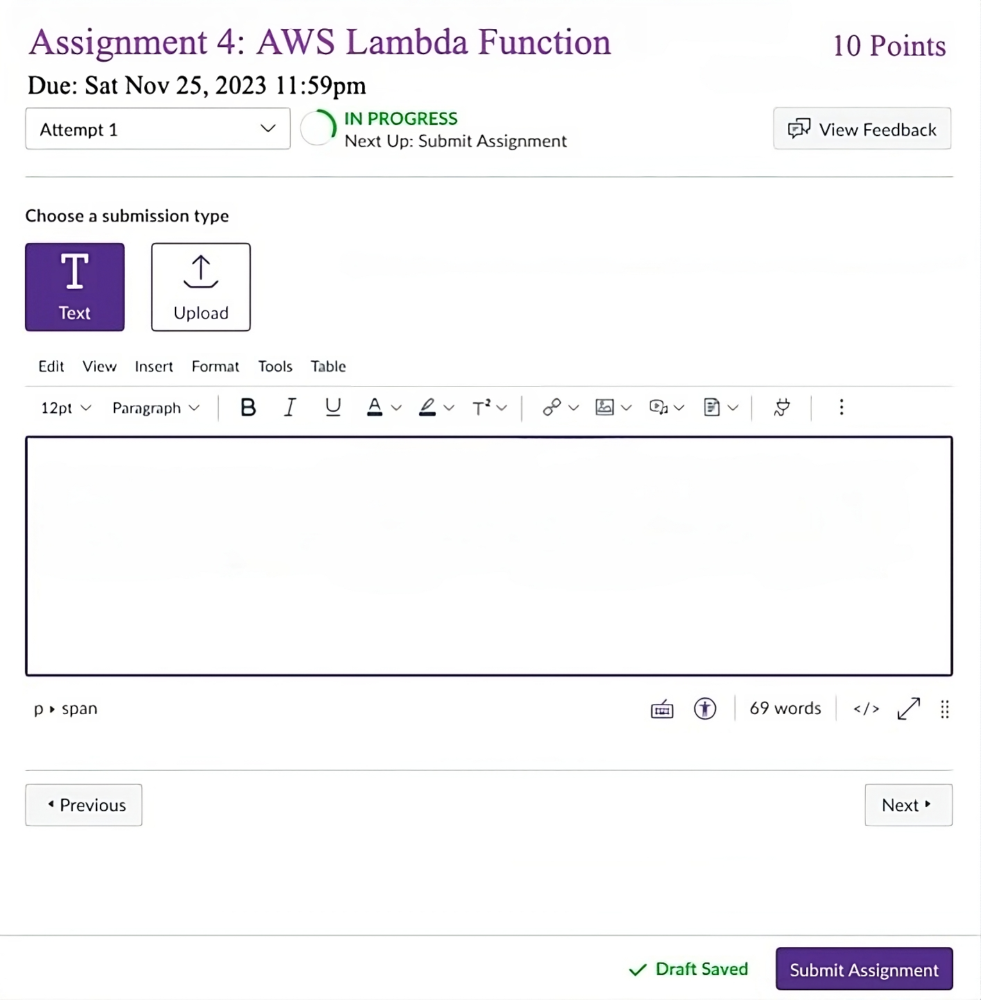

## Network structures and cloud computing (CSYE 6225) 

## Assignments Tracker - Cloud Native Web Application

    

## Overview
The Assignments Tracker is an application designed for streamlined assignment submissions. It emphasizes a secure, reliable, scalable, and highly available architecture on AWS, offering optimal performance for educational institutions and learners.

### Repositories
- Web Application: [GitHub - Webapp](https://github.com/Nikhil-Reddy-Karukonda/webapp)
- IAC Pulumi: [GitHub - IAC Pulumi](https://github.com/Nikhil-Reddy-Karukonda/iac-pulumi)
- Serverless: [GitHub - Serverless](https://github.com/Nikhil-Reddy-Karukonda/serverless-fork)



## Project Setup

### Prerequisites
Before building and deploying the application, ensure you have the following prerequisites:

- AWS Account and CLI setup, Debian 12 OS
- Node.js and npm installed
- PostgreSQL installed

### Installation

1. **Clone the Repository**
   ```bash
   git clone https://github.com/Nikhil-Reddy-Karukonda/webapp
   cd webapp
   ```

## Environment Configuration 🌐

Create a `.env` file in your project directory and configure the following parameters:

```env
DB_USERNAME=<your_database_username>
DB_PASSWORD=<your_database_password>
DB_HOST=<your_database_host>
DB_DIALECT=<your_database_dialect>
DB_PORT=<your_database_port>
DB_NAME=<your_database_name>
PORT=<application_port>
ENV_TYPE='DEBIAN_VM' # Or 'GITHUB_CI' Or 'pulumi'   

Install Dependencies 🔧
`npm install`

Start the Application  🚀
`npm start`

Running Tests 🧪
`npx mocha tests/*.test.js`

```
In the `ami.pkr.hcl` file, the following default values are set for key variables:
**source_ami** - "debian_12_ami_id"
**subnet_id** - "subnet_id_default_vpc"
**ami_region_list** - ["us-east-1"]
**ami_users_list** - ["dev_aws_account_id","demo_aws_account_id"]

### Features
- :cloud: **Cloud-Native NodeJS Backend**: Secure, efficient handling of requests, Infrastructure as Code (IaC) using Pulumi, Serverless architecture for efficient resource management
- :lock: **Enhanced Security**: Configured Security Groups for Load Balancer, EC2, and RDS with SSL/TLS encryption via AWS Certificate Manager, passwords are hashed using BCrypt algorithm
- :globe_with_meridians: **DNS Management**: Streamlined web app access with Route53 for DNS setup, including A, NS, and TXT records.
- :repeat: **High Availability**: Deployed across multiple Availability Zones (AZs) using Pulumi IAC, ensuring 99.99% uptime.
- :chart_with_upwards_trend: **Auto-Scaling**: Dynamic resource management with auto-scaling groups and CloudWatch CPU utilization alarms.
- :hammer_and_wrench: **CI/CD Workflow**: EC2 Automation with GitHub Actions & HashiCorp Packer, **Integration**: GitHub Actions with HashiCorp Packer for custom AMIs, **Automation**: EC2 app auto-startup via systemD; configures web apps, DB servers, autorun in `/etc/systemd/system`, **Scaling**: Consistent Auto Scaling Group refreshes with updated AMIs.
- :file_folder: **Reliable File Delivery System**: Reliable file delivery system for assignment submissions, automating GitHub release downloads to S3 via Lambda and SNS triggers, with streamlined user notifications and DynamoDB for enhanced tracking and auditability

## Web Application Features and Testing Instructions

## Application Traffic Source
 
- Application traffic is managed through a load balancer.

## Load Balancer Security

- Load balancer utilizes valid SSL certificates.
- The web application is accessible only through the load balancer.

## Submission Features

### :airplane: **POST Requests**: Users can make POST requests for submission.
### :page_facing_up: **Multiple Submissions**: Users can submit multiple times per assignment based on retries configuration.
### :no_entry_sign: **Retries Limit**: After exceeding the number of attempts, requests will be rejected.
### :calendar: **Due Date Enforcement**: Submissions are rejected if the assignment due date has passed.
### :bell: **Notification**: Submits URL and user info (e.g., email address) to the SNS topic.

## Health Check RESTful API

## Purpose

- Monitors the health of the application instance.
- Alerts when instances are not functioning as expected.
- Manages traffic by avoiding unhealthy instances.

## Key Monitoring Aspects

1. **Database Connection**: Ensures the application's connection to the database.
2. **Downstream API Calls**: Verifies the application's dependency on other APIs and their availability.

## API Endpoints and Testing

- Implemented a `/healthz` [GET] endpoint for health checks.
- Conducted integration tests to ensure reliability.

- Regular testing of the `/healthz` endpoint to verify application connectivity and downstream API functionality.
- [GET] /v1/assignments -- GET All assignments
- [POST] /v1/assignments
- [PUT] /v1/assignments/:id
- [GET] /v1/assignments/:id
- [DELETE] /v1/assignments/:id
- [POST] /v1/assignments/:id/submission -- submit assignment

## Useful Commands

## Network Commands

- `lsof -i:8080` - List open files on port 8080.
- `kill -9 **pid**` - Force terminate a process.

## Utility Commands

- `which curl` - Locate the binary, source, and manual page for curl.

## System Updates and Installation

- `sudo apt update` - Update package lists.
- `sudo apt install postgresql` - Install PostgreSQL.
- `sudo systemctl start postgresql` - Start PostgreSQL service.

## PostgreSQL Commands

- `SELECT version();` - Display PostgreSQL version.
- `\l` - List all databases.
- `\c postgres` - Connect to the 'postgres' database.
- `\d assignments` - Display the 'assignments' table structure.
- `\q` - Quit the psql terminal.

## Packer - Custom AMI - Github Actions - Raise/merge PR

- `packer init ami.pkr.hcl`
- `packer validate ami.pkr.hcl`
- `PACKER_LOG=1 packer build ami.pkr.hcl`

## SSH and Key Management

- `chmod 400 /path/my-key-pair.pem` - Secure key file.
- `ssh -i "/path/my-key-pair.pem" admin@[instance-public-ip-or-dns]` - SSH into instance.
- Key-pair location `~/.ssh/`

## PostgreSQL Management (macOS)

- Navigate to PostgreSQL bin: `cd /Applications/Postgres.app/Contents/Versions/latest/bin`
- Connect to PostgreSQL: `./psql -U user_name -d password`

## Service Management

- `sudo systemctl status service_name` - Check the status of a service.
- `journalctl -u service_name` - View logs for a service.


## AWS Services and Features 🌐

### Compute and Networking 🖥️
       

### Storage and Content Delivery 📦
  

### Security and Identity 🛡️
   

### Networking and Content Delivery 🌍
    

### Monitoring, Logging, and Notification 📊
   

### Development and Automation Tools 🛠️
   
